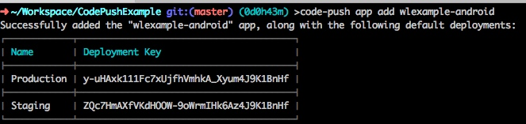
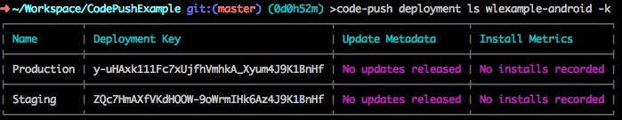
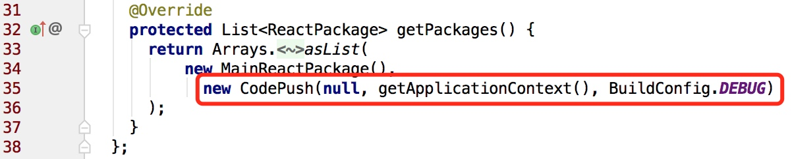
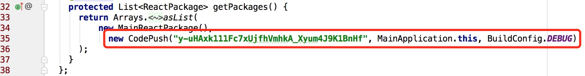
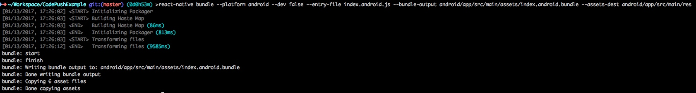
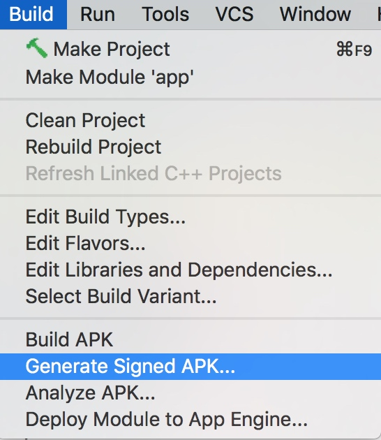
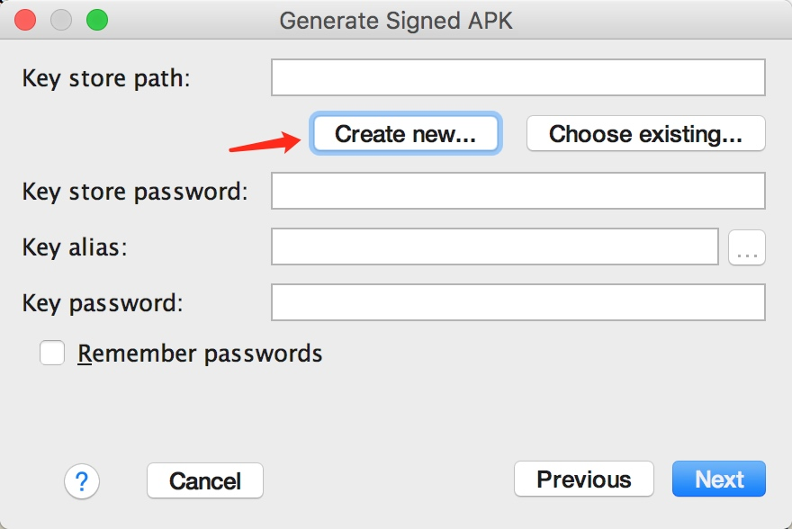
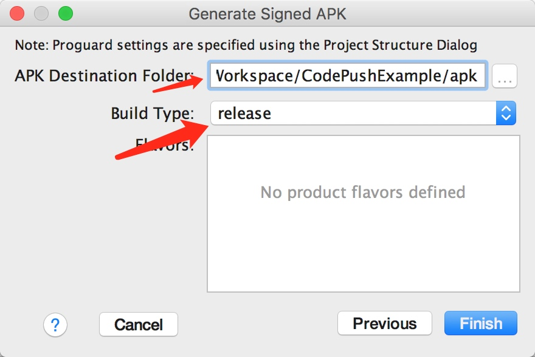

# Android Code Push 

前面几步 `安装 code-push-cli 工具`，`初始化 react native 工程`，`在工程内安装 react-native-code-push`，`add link`，`修改代码` 均和 iOS 的文档一致

* 执行 `code-push app add <appname>-android`，这里我们执行的是 `code-push app add wlexample-android`

    
查询发布信息 `code-push deployment ls wlexample-android -k`


* 修改 `MainApplication.java` (for React Native >= v0.29)，由于之前已经 link，所以要修改的地方不多，如下：

修改为：

这里的 **`y-uHAxk111Fc7xUjfhVmhkA_Xyum4J9K1BnHf`** 就是上一步 `code-push app add wlexample-android` 生成的 **Production** 的 Deployment Key 的值。
> React Native 版本小于 0.29，请参考[官方文档](https://github.com/Microsoft/react-native-code-push#plugin-configuration-android)

* 新建的 react native android 是没有 asset 目录的，因此首先执行 

    ```bash
    mkdir android/app/src/main/assets
    ```

* 打包应用

    ```bash
    react-native bundle --platform android --dev false --entry-file index.android.js --bundle-output android/app/src/main/assets/index.android.bundle --assets-dest android/app/src/main/res
    ```
    

* build

    

> 测试应用这里的值随便填写即可
    
    
这里要选择 **release**，同时选择一个生成 release-apk 的路径

* 运行程序，这里简单录制了一个视频，方便查看

    [android](img/android/android.mp4)

