# iOS Code Push 
1. 安装 code-push-cli 工具

    `npm install code-push-cli@latest -g`
    
2. 初始化 react native 工程

    `react-native init CodePushExample`
    
3. 在工程内安装 react-native-code-push

    `cd CodePushExample && yarn add react-native-code-push`
    
4. add link
    
    ```bash
    # react-native 0.27+
    react-native link react-native-code-push
    
    # react-native <0.27
    rnpm link react-native-code-push
    ```
    
    

    > ? What is your CodePush deployment key for Android
    > ? What is your CodePush deployment key for iOS
    
    均先按回车忽略
    
5. 修改代码，把 `index.ios.js` 和 `index.android.js` 里面的代码改为 `require('./demo');`，同时在同级增加 `demo.js`，内容如当前 repo 所示。

6. 用 xcode 打开 `CodePushExample/ios/CodePushExample.xcodeproj`，同时把 `CodePushExample/node_modules/react-native-code-push/ios/CodePush.xcodeproj` 这个文件拖入到 xcode 工程 Project navigator 的 Libraries 中。
    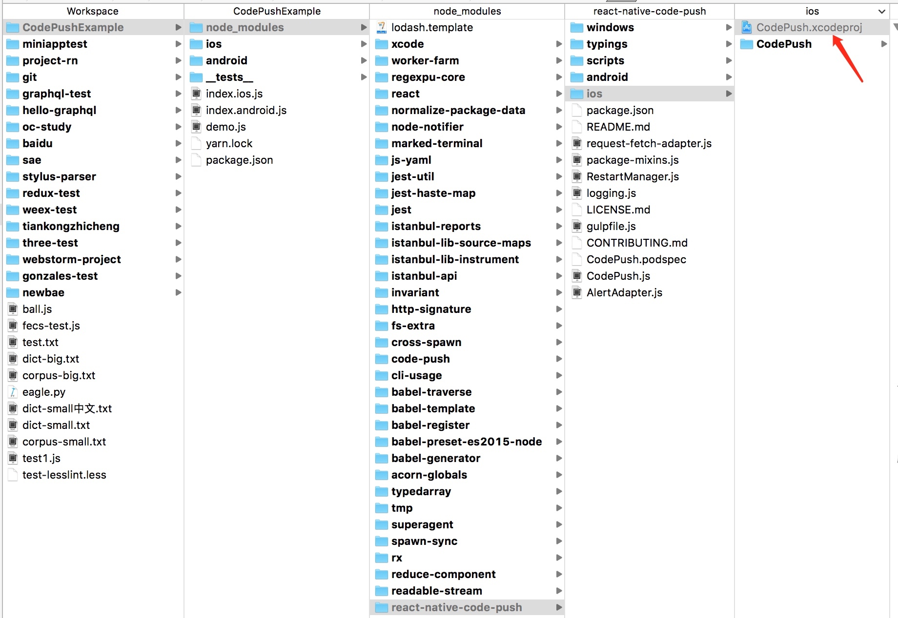
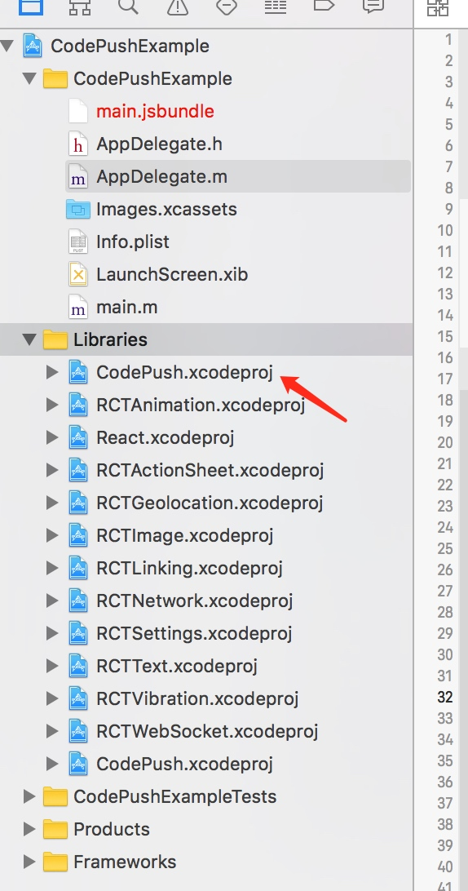

7. 在 xcode 项目面板中选择根节点 `CodePushExample`，然后选择 `Build Phases` tab，把 Libraries/CodePush.xcodeproj/Products/libCodePush.a 拖入到 Link Binary With Libraries 中（注意，如果在 Libraries/CodePush.xcodeproj/Products/libCodePush.a 时候红色字体显示，说明 CodePush.xcodeproj 尚未 build，需要先 build）

    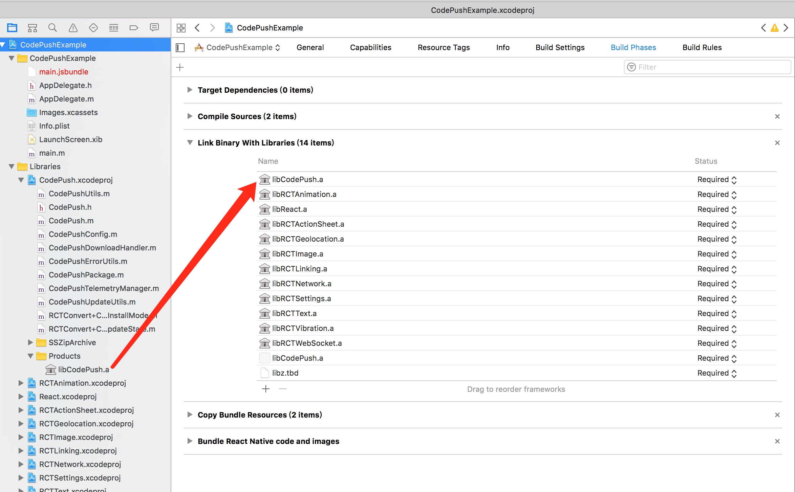

8. 点击 Link Binary With Libraries 里面的加号，在弹出框中选择 libz.tbd，然后加入 iOS 10.2/libz.tbd

    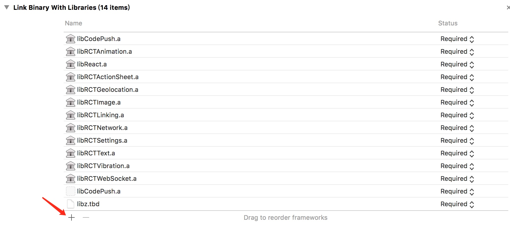
    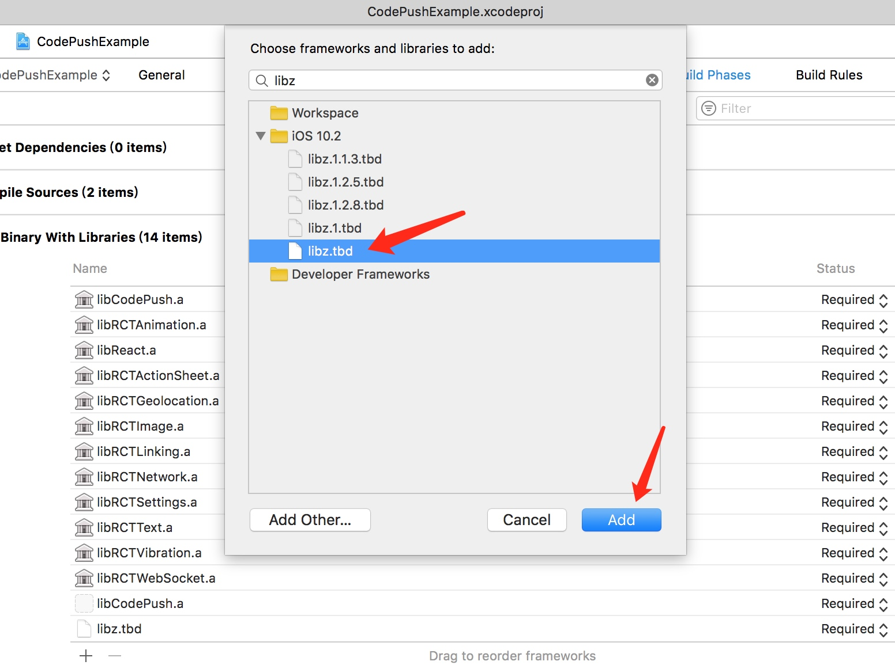

9. 在 Build Settings tab 里，搜索 `Header Search Paths`，然后编辑，添加 `$(SRCROOT)/../node_modules/react-native-code-push/ios`，下拉框中选择 `recursive`

    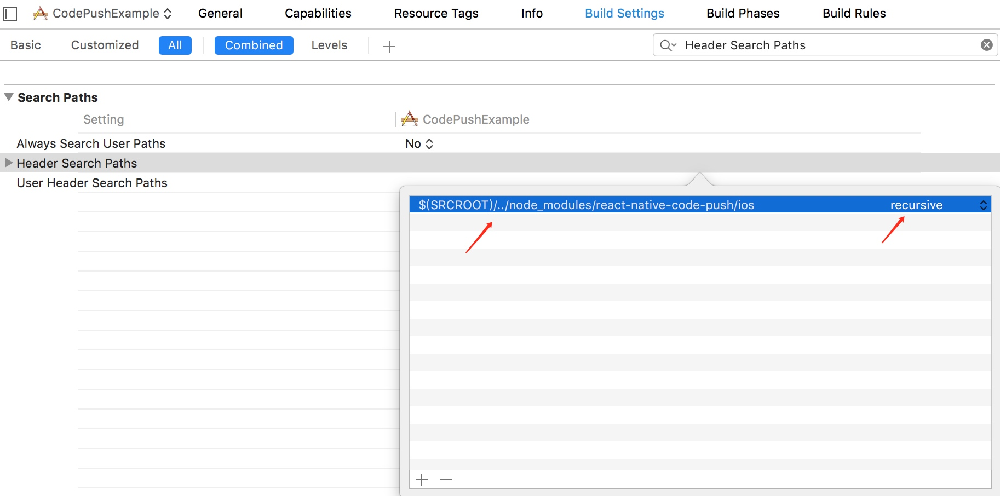
    
10. 执行 `code-push register`

    


11. 执行 `code-push login`

    
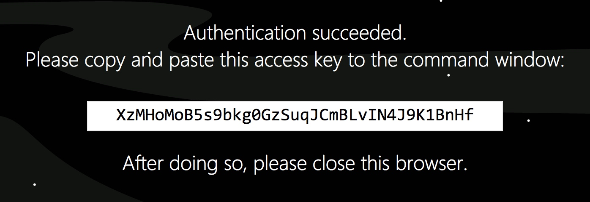 


12. 执行 `code-push app add <appname>-ios`

    这里的 <appname> 不需要和项目的名称相同，后面加上 `-ios` 只是为了名字上与 android 版本作区分。如我在这里使用的是如下名称
    
    ```bash
    code-push app add wlexample-ios
    ```
    执行结果如下：
    

    我们可以通过这个命令查询发布的信息 `code-push deployment ls wlexample-ios -k`
    

13. xcode 修改 Info.plist，如下：

    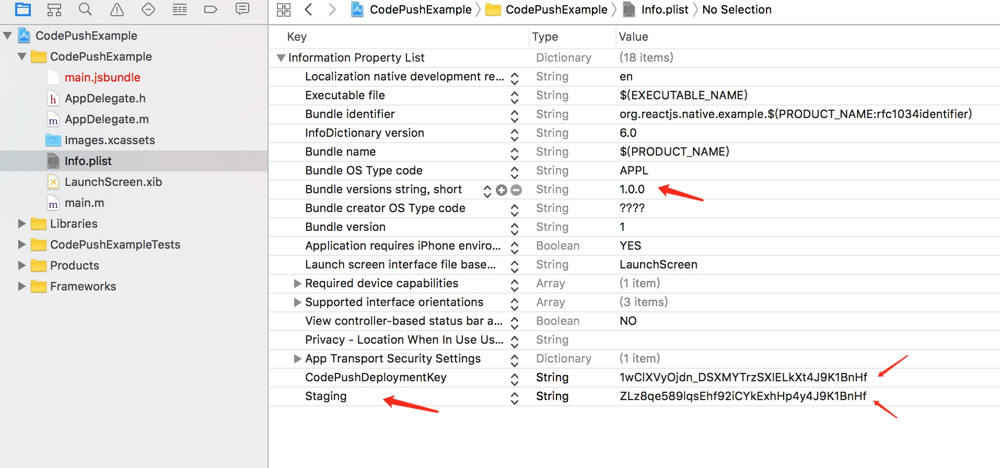

    * 修改 `CodePushDeploymentKey` 的值为第 12 步生成的 **Production** 的 Deployment Key
    * 添加 `Staging` 项，值为第 12 步生成的 **Staging** 的 Deployment Key
    * 修改 `Bundle versions string, short` 的值为 `x.x.x` 三位形式

14. 关闭 `Dead Code Stripping`

    


15. 运行程序，注意使用 `Release` Build

    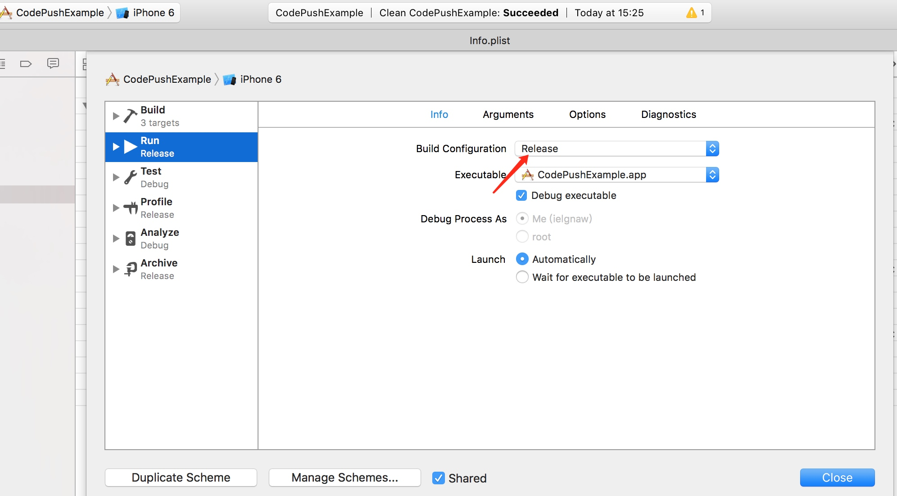
初次运行是这样的结果：
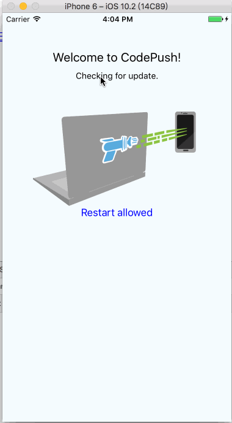
查询发布信息 `code-push deployment ls wlexample-ios -k`，结果如下


16. 现在让我们修改源代码，如下修改

    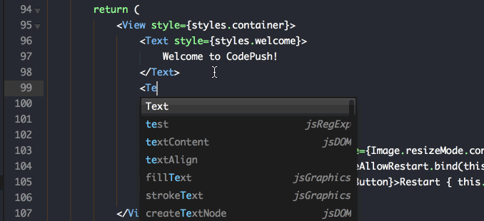    

17. 发布更新，注意名字和我们之前 `code-push app add` 时的名字一致

    ```bash
    code-push release-react wlexample-ios ios -d Production
    ```
    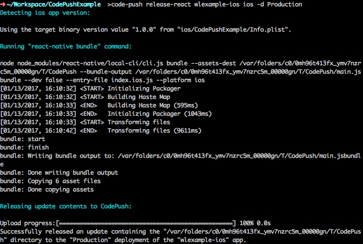

    
    再次查询发布信息 `code-push deployment ls wlexample-ios -k`


18. 在模拟器中重启程序。**不需要在 xcode 中重新 build 了**

    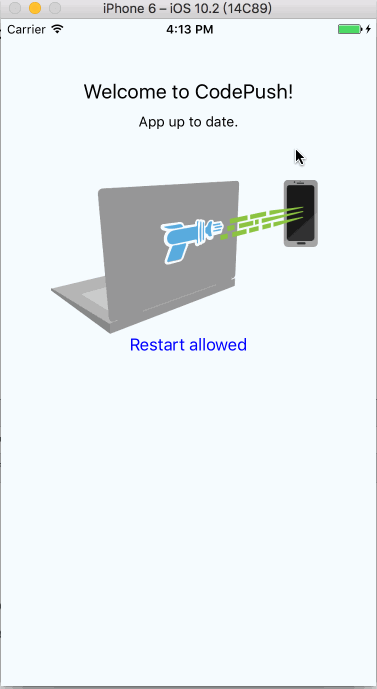


